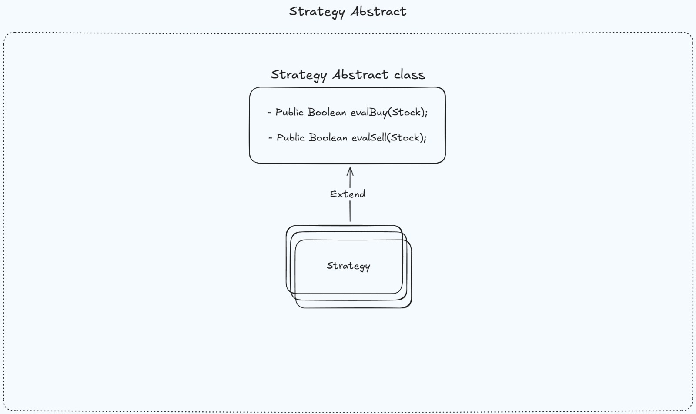

# Financial Trading Simulation System

This project simulates a financial trading system using Akka actors, Kafka messaging, and PostgreSQL database for persistence.

## System Overview

The system consists of three main components:

1. **Quote Generator**: Generates stock quotes for fictional companies and publishes them to Kafka
2. **Traders**: Consume quotes from Kafka and make buy/sell decisions based on different strategies
3. **Audit Service**: Validates trades and maintains the system state in PostgreSQL

## Architecture


- **Akka Actor System**: Used for handling concurrent operations and message passing
- **Kafka**: Message broker for quote distribution
- **PostgreSQL**: Persistent storage for trader balances, stocks owned, and audit logs

## Data Model


## Trading Strategies

The system implements a Strategy pattern using an abstract class that can be extended with different implementations:



Three trading strategies are implemented:
- **AlwaysBuyAlwaysSellTradingStrategy**: Always attempts to buy any stock and sell any owned stock
- **RandomBuyAlwaysSellTradingStrategy**: Randomly decides whether to buy a stock but always sells owned stocks
- **OnlyBuyCheapAlwaysSellTradingStrategy**: Only buys stocks priced below $50 and always sells owned stocks

## Message Flow

The detailed message flow between system components is illustrated below:


## Future Enhancements

* **Scalable Audit Service**: Extend the audit component using multiple actors to handle user validation requests through a router pattern with a configurable number of audit actor instances.

* **ORM Integration**: Add JPA/Hibernate as an ORM layer to further abstract database operations and streamline entity relationship management.

* **Enhanced Trading Strategies**: Expand available strategies with technical analysis indicators like moving averages, MACD, or RSI.

* **Resilience Patterns**: Implement circuit breakers and retry mechanisms for database and Kafka operations.

* **Failure Detection**: Create a monitoring system that detects actor failures and Kafka connectivity issues with automated notifications.

* **Builder Pattern Implementation**: Apply the Builder pattern for complex object creation, especially for Stock and Quote objects.

* **Dynamic Strategy Assignment**: Enable traders to switch strategies dynamically based on market conditions and performance metrics.
* 
* **Unit Testing with Akka TestKit**: Implement comprehensive unit tests using Akka's TestKit to verify actor behavior, message handling, and trading strategy logic in isolation.

## Running Instructions

### Running Docker Environment
```bash
docker-compose up -d
```

The docker-compose file sets up:
- PostgreSQL database
- Adminer (database UI) on port 8080
- Kafka broker
- Kafka-UI on port 8081

### Database Initialization
Database tables are automatically created during startup using the SQL scripts in the `init-scripts` directory mounted to the PostgreSQL container:

- The database is pre-configured with 10 traders, each with an initial balance of 1000.00
- To add more traders, modify the `02-insert-data.sql` file in the `init-scripts` directory

### Customizing the Simulation

The trading simulation can be configured by modifying several key parameters in the `App.java` file:

```java
// Controls how many price variations are generated for each stock symbol
// With 5 stock symbols and a value of 10, there will be 50 total stock quotes
List<Stock> stocks = generateStonks(10);

// Sets the number of trader actors that will participate in the simulation
int numberOfTraders = 10;

// Defines the stock symbols and company names used in the simulation
List<String[]> stockSymbolNames = Arrays.asList(
    new String[]{"GOOGL", "Alphabet Inc"},
    new String[]{"TSLA", "Tesla Inc"},
    new String[]{"IBM", "International Business Machines Corp"},
    new String[]{"ORCL", "Oracle Corp"},
    new String[]{"STONK", "Stonks Corp"}
);
```

Key configuration options:
* **Stock Variants (`generateStonks` parameter)**: Controls market activity volume by generating multiple price points per stock
* **Number of Traders**: Determines how many trader actors compete in the market
* **Stock Symbols**: Defines which companies are available for trading


### Monitoring the System
After running the application:

1. Access Adminer at http://localhost:8080
   - System: PostgreSQL
   - Server: database
   - Username: root
   - Password: root
   - Database: finance-app

2. Access Kafka-UI at http://localhost:8081 to monitor the Kafka topics and messages

3. To find the most successful trading strategy, execute this query in Adminer:
```sql
SELECT
  t.trader_id,
  COALESCE(sum(s.price), 0) as stocks_value,
  MAX(t.balance) as trader_balance,
  MAX(t.balance) + COALESCE(sum(s.price), 0) as estimated_total
FROM trader t
LEFT JOIN stock s ON s.trader_id = t.trader_id
GROUP BY t.trader_id
ORDER BY estimated_total DESC
```

This query shows each trader's total assets (cash balance + stock value), helping identify which trading strategy performed best.
